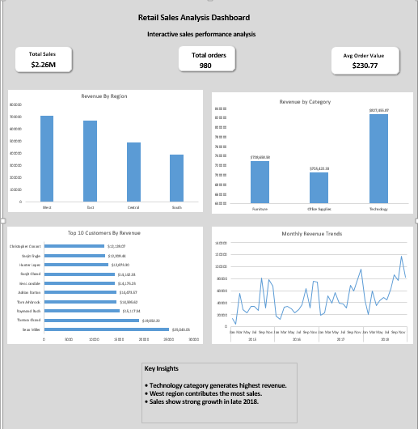
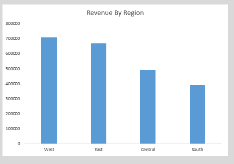
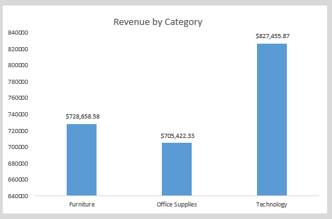
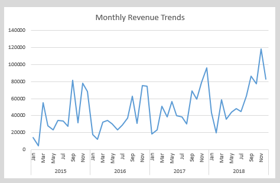

⭐ If you found this project useful, please consider giving it a star!

# Retail Sales Analysis Dashboard (Excel)

## 📊 Project Overview

This project presents an **interactive Retail Sales Analysis Dashboard** built using Microsoft Excel.
The goal of this project is to analyze retail sales performance and visualize key business metrics such as revenue, customer contribution, product category performance, and monthly sales trends.

The dashboard helps users quickly understand **sales distribution across regions, product categories, and customers** using clear visualizations and key performance indicators.

---

## 🛠 Tools & Technologies

* Microsoft Excel
* Pivot Tables
* Pivot Charts
* Data Visualization
* Slicers (for interactive filtering)

---

## Project Workflow

1. Data Cleaning in Excel
2. Created Pivot Tables
3. Built Pivot Charts
4. Added Slicers for Interactivity
5. Designed Final Dashboard Layout

---

## 📈 Key Performance Indicators (KPIs)

* **Total Sales:** $2.26M
* **Total Orders:** 9800
* **Average Order Value:** $230.77

These KPIs provide a quick overview of overall business performance.

---

## 📊 Dashboard Features

The dashboard includes the following analytical components:

* **Revenue by Region** – compares sales performance across different regions.
* **Revenue by Product Category** – identifies which product categories generate the most revenue.
* **Top 10 Customers by Revenue** – highlights the highest value customers.
* **Monthly Revenue Trend** – shows sales performance over time.
* **Interactive Filters** – slicers allow users to dynamically filter the dashboard.

---

## 🔍 Key Insights

From the analysis:

* The **Technology category** generates the highest revenue among product categories.
* **West and East regions** contribute a significant share of total sales.
* A small number of customers generate a large portion of revenue.
* Sales show **variation across months**, indicating possible seasonal trends.

---

## 🖼 Dashboard Preview

## Dashboard Preview

### Overview

### Sales by Region

### Sales by Category

### Monthly Trends

---

## 📁 Project Structure

Retail-Sales-Analysis-Dashboard
│
├── Retail_Sales_Analysis_Dashboard.xlsx
├── dashboard overview.png
├── dashboard region.png
├── dashboard category.png
├── dashboard monthly trends.png
└── README.md

---

## 🎯 Skills Demonstrated

* Data Cleaning and Preparation
* Pivot Table Analysis
* Data Aggregation
* Data Visualization
* Dashboard Design
* Business Insight Generation

---

## 🚀 Project Goal

This project demonstrates how **Excel can be used as a powerful data analysis and dashboarding tool** to transform raw data into meaningful insights for business decision-making.

This project demonstrates how **Excel can be used as a powerful data analysis and dashboarding tool** to transform raw data into meaningful insights for business decision-making.

